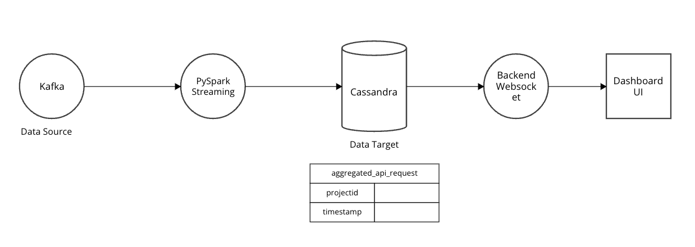

# Simple end to end data streaming
    Kafka Topic -> Spark Streaming (Window()) = Data Aggregated -> Cassandra -> BackEnd (Websocket) -> Dashboard UI


## Introduction

This repository contains the source code and configuration for a real-time data processing pipeline that aggregates data from a Kafka topic, performs real-time analytics using Spark Streaming, stores the aggregated data in Cassandra, and updates a dashboard UI in real-time through a WebSocket connection.

## Architecture



## Components

### 1. Kafka Topic

- Stock Data from yfinance is ingested into the pipeline through a Kafka topic.
- Kafka is a distributed event streaming platform, providing a scalable and fault-tolerant mechanism for data ingestion.

### 2. Spark Streaming (Window())

- Utilizing Spark Streaming for real-time data processing.
- The `Window()` function is applied for windowed operations to aggregate data over specific time intervals.

### 3. Data Aggregated

- Data is aggregated within the Spark Streaming step using various aggregation functions.
- Common operations include summing, averaging, counting, etc., depending on the specific use case.

### 4. Cassandra

- Aggregated data is stored in Cassandra, a highly scalable NoSQL database.
- Cassandra is chosen for its ability to handle large volumes of data across multiple nodes.

### 5. BackEnd (WebSocket)

- The backend of the application communicates with the front end through a WebSocket connection.
- WebSocket enables bidirectional communication, allowing real-time updates to be sent from the server to the client.

### 6. Dashboard UI

- The Dashboard UI provides a user interface for visualizing and interacting with real-time aggregated data.
- Used an Angular-based dashboard for dynamic visualization of stock trends, providing users with instant updates and interactive charts powered by WebSocket connections.


## Usage

### Prerequisites

- Docker
- Docker Compose

### Installation

1. Clone the repository:

   ```bash
   git clone https://github.com/TanishKolli/Stock_Tracker
   cd Stock_Tracker
   docker-compose up


## License

This project is licensed under the terms of the MIT license.
